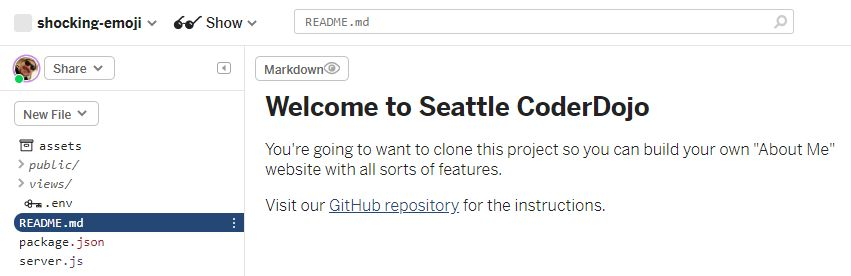
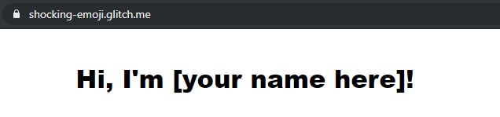
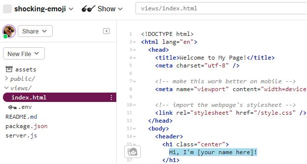
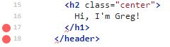
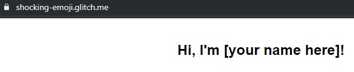
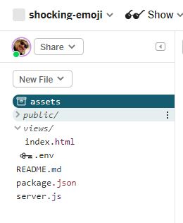
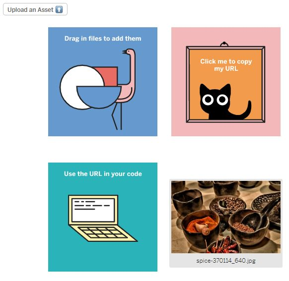
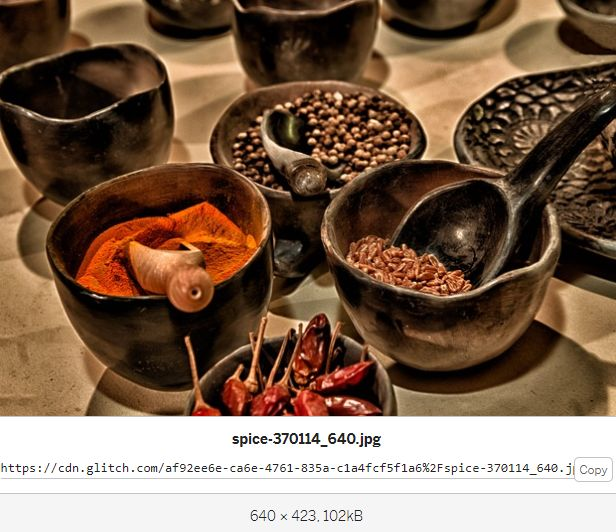
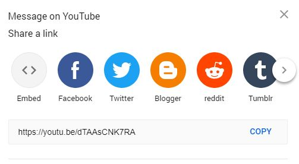
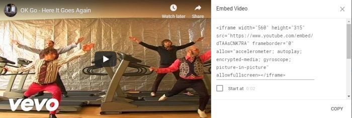

Seattle CoderDojo Full Stack Web Developer Workshop

# Week 1: Building a basic webpage

What we're going to do this week:

1. Clone a webpage project
2. Make the webpage yours
3. Add a link to the page.
4. Add a photo to the page.
5. Add a video to the page.
6. Mess with CSS.


## Cloning the project


To get started, we're going to clone the base project on Glitch.com. Glitch provides a simple way for you to easily develop sample apps using HTML and node.js.

We'll get into these. Later. Let's get cloned.

1. First you need to go to [Glitch.com](https://glitch.com) and either sign in or create an account.
2. Next, go to the [silicon-stealer](https://glitch.com/~silicon-stealer) project. 
3. Next click the remix button (it's got a microphone on it).

You now have the basic project set up.




If you click on the glasses, next to "Show," you can show the current web page.




That's all you've got.

Let's change that. Your page is held inside the views folder as a file called index.html. Click on "views/" and then click on "index.html"




We've highlighted the section where it says "Hi, I'm [your name here]!" Find that in your own index.html and change "[your name here]" to your first name.

Now here's a cool thing about Glitch. It automatically saves your changes. So you can now go to the window where your preview was showing, reload it and it should show something new.

Now we've got a page that introduces you.


## Markup & Tags & Elements, Oh My

Let's look at that page's structure. 

We're using HTML or "HyperText Markup Language" to tell the web browser how to construct and display the web page. 

Each bit inside angle brackets is called a tag. And the first thing we do is use a "doctype" tag to tell it, the type is HTML.

```html
<!DOCTYPE html>
```

Then we'll add an HTML element to show it where the HTML starts and ends. We'll open the html element with this tag, then we'll use another tag at the end to close the element.

```html
<html lang="en">
```

Inside the HTML, we generally have two elements representing distinct sections of the document. The **head** section contains information about the page, like its title and maybe some other files it might need, but not stuff you'll expect the web browser to show in the page itself.

```html
  <head>
    <title>Welcome to My Page!</title>
    <meta charset="utf-8" />

    <!-- make this work better on mobile -->
    <meta name="viewport" content="width=device-width, initial-scale=1" />

    <!-- import the webpage's stylesheet -->
    <link rel="stylesheet" href="/style.css" />
  </head>
```

Note how the &lt;head&gt; element was closed with a &lt;/head&gt;. The tag without a forward slash opens or starts the element. Then a tag that starts with a forward slash and has the same name closes the element.

The stuff you'll expect to go on the page goes in the **body** element.

```html
  <body>
    <header>
      <h1 class="center">
        Hi, I'm [your name here]!
      </h1>
    </header>

    <main></main>

    <footer></footer>
  </body>
</html>
```
We also have **header**. **main**, and **footer** elements inside the body element. These aren't strictly required, but they're useful for helping us organize what we're putting in. We'll use them later.

Right now, let's look at your greeting. You'll see it's in an H1 element. This is a heading element. They're used to organize things... H1 is the most important topic. H2 is a subtopic of H1, H3 is a subtopic of H2, and so on through H6. The lower the number, the bigger the letters, because it's more important.

Let's try changing your H1 element to an H2.



Why did those two red dots appear next to lines 17 and 18? 

Remember how the tag with the forward slash closes the element? Your H2 element isn't closed. There's a closing tag for an H1 element that doesn't exist, so that's an error. Then you're trying to close the header element, but you haven't closed the H2 inside it, so that's an error.

How do you fix it?

Right, change the H1 in the closing tag to H2. Tag closed, dots disappear. Reload your other window where you show the webpage. 



The text got smaller. We actually want it to be an H1, because it's the top item (and the most important) on the page. So it should be bigger.


## Add a link to the page

Now we're going to add a link to the page. A link is a pointer to another webpage or resource on the web.

Let's find the web site for your favorite restaurant. I like a restaurant in Mill Creek called [Azul](http://azullounge.com/). It's got my favorite chips and salsa. So I'm going to go to Google and find their web site. Looking for "Azul Mill Creek" got me the right site at the top of the results. Try the name of your favorite restaurant, and if it's not a big chain like McDonalds, use the city to help you find it.

When you've found the restaurant's page, copy the URL.

We can link to other resources on the web using HTML "a" elements.

In the "main" section of your page, add a link to your favorite restaurant like this...

```
<main>
  <h2>My favorite restaurant is:</h2>
  <p><a href="http://azullounge.com/">Azul</a></p>
</main>
```

We used an H2 element for the title of the section.

Then we used a "p" (for paragraph) element to hold the text of our link. We use an "a" element and inside the opening tag, we provide an **attribute**, the href. That stands for "hypertext reference." 

It can point to an external webpage, another page in your site, a different section of your page, or even a straight up file. Here, we give it the URL of the restaurant's web page.

Many tags can have attributes. You might have noticed that we used a "class" attribute in the H1 tag.

Test your link to make sure it works.


## Add a photo to the page

I should probably stop here and explain that we won't add any photos of you to the main page. This is for your safety. We don't know who might end up looking at the page.

Let's find a photo of something you like. We'll go to [Pixabay](https://pixabay.com). It's a great site with lots of free photos you can download and use. Search for something you like or pick a photo from the front page. I like cooking.

I'll pick a photo, and then click the "free download" link on that photo's page. 


Choose the smallest size and click download. You'll get a dialog to save it to your computer. If you're on a computer where you can't save files to it, ask a mentor to help.

On Glitch, we'll choose "assets" in the list of files and directories.



You can then drag your photo to it. And when the photo is uploaded, it will be shown.



Click your photo, and you'll see a URL you can use to reference it. Click the copy button to copy that URL.



Now, let's add that into the web page. Click back into the index.html file and add this below the link to your favorite restaurant, but with the URL for your photo instead of mine.

```html
<h2>Things I like:</h2>
<p>Cooking. <br>
</p>
```

After we put the title in the "p" element, we used a "br" element to create a break, then an "img" element for the photo. In the "img" element, we used the "src" (source) attribute to provide the URL of the photo, and we also added "height" and "width" attributes. 

The height and width aren't required, but it's a good practice.

Then we added an "alt" attribute. If the browser has trouble showing the image or the person checking out your site is blind, it's used to describe the photo. It's also not required by HTML, but important to use so your site is usable.

Also, notice that the "img" tag doesn't need to be closed. 

View your page, then we'll take a break and add a couple more things you like.


## Add a video to the page

Now we're going to add video to the page. One of my all-time favorite music videos is OK Go's "Here It Goes Again." I'm going to find it on YouTube. I'll also pause it so there's not a lot of noise while I try to talk.

Under the video, I can click the "share" link.



When I click the embed option, it will give me code I can add right into my webpage. I'll just copy it.



Then I can use an H2 to start another section and paste in the code.

```html
<h2>Some of my favorite videos:</h2>
<iframe width="560" height="315" src="https://www.youtube.com/embed/dTAAsCNK7RA" frameborder="0" allow="accelerometer; autoplay; encrypted-media; gyroscope; picture-in-picture" allowfullscreen></iframe>
```

The code that YouTube gives you is an "iframe" which actually opens a frame in your page into which they can load their own HTML. For security reasons, stuff in the iframe can't do everything your code in the page can do, but it can do enough for embedding a video.

Embed a couple more favorites. Notice I didn't specifically say music videos, so I can add others... like programming videos or funny animal videos.


## Let's mess with CSS

[some fun css tricks]


## Coming Next Week

Take some time and personalize the page, but don't give out too much information.

Next week, we'll create a password-protected "Friends-Only" section of the site where you can share stuff with your friends that the rest of the world doesn't deserve to know.