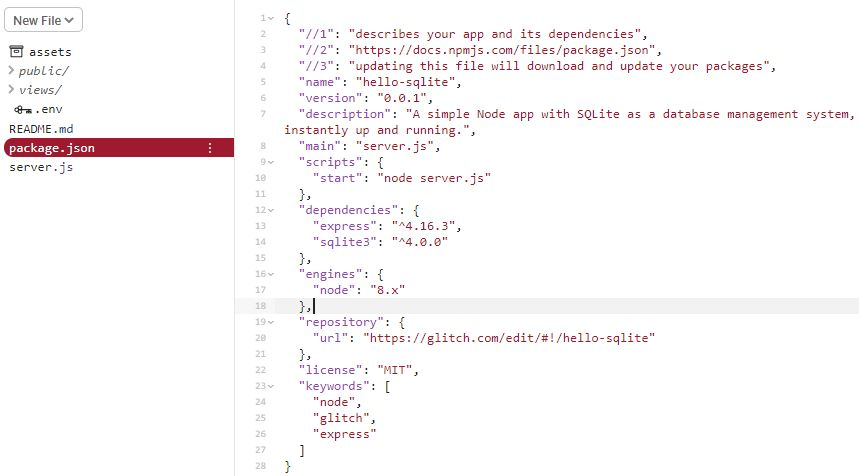
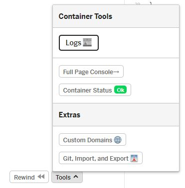
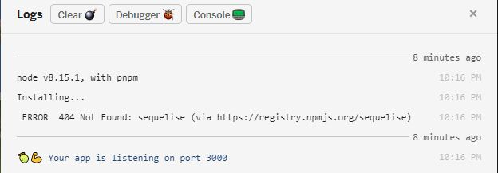
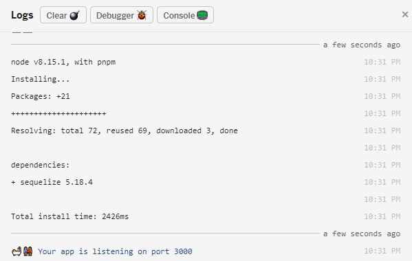
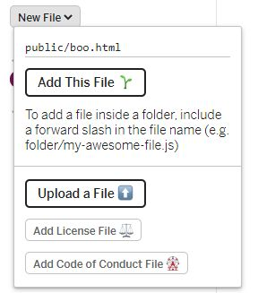
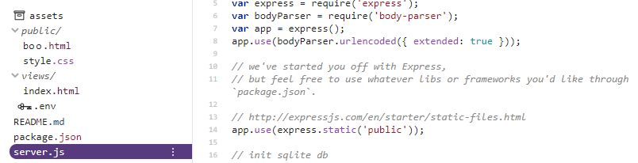
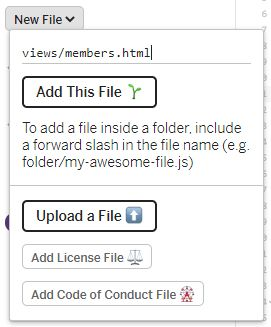

# Week 2: Let's get dangerous

**FIRST AND FOREMOST:** Let's go back to glitch.com and open the projects we were working on last week. If you missed last week, you can clone [my project from last week](https://glitch.com/edit/#!/shocking-emoji), by following the link, clicking on the "shocking-emoji" title in the upper left of the screen, and clicking the "Remix Project" button. You will get my  page, but you can go back to [last week's write-up](https://github.com/seattlecoderdojo/FullStackWebDevWorkshop-Sept19/tree/master/week1) and learn how to customize it and make it your own.


What we're going to do this week:

1. Learn about node and its module system
2. Create our member page


## What is Node.js

JavaScript started life way back in the 1990s as a language that let you make web pages do more programmatic things. It has NOTHING to do with Java. In fact, many people say that Java and JavaScript share as much in common as ham and hamsters.


We could go into the history of JavaScript and Node, but we came here to make stuff. History lessons are for the school part of the week. Let's just say it's JavaScript for controlling stuff on your web server.

## Node Modules

There are two main reasons Node caught on. 

One is that people felt it performed better than Apache, the most popular web server of the time. We can go into why people thought that, but again, we're not here for a history lesson. 

The second is node had just a medium selection of core functions, and then you just added modules to outfit a Node server with what you needed. This helped make it faster because it wasn't too heavy, plus people started making and sharing tons of modules which made it easier to do cool things. 

Those modules are declared in your `package,json` file. Let's look at that file in our projects.



This file is standard for Node.js apps, tells you a lot about the app, and helps install the app on a server. It's in a format called JSON (pronounced like the name Jason), which means JavaScript Object Notation. Hopefully you know what an object is. But a very quick description is that it's a way of putting information and functionality into a package. 

The information is called properties. The functionality is called methods.

So an address object might have a property like the name of the street you live on. A method might be a bit of code that redirects the user to a Google Maps page with the house marked on it.

An object will be wrapped in curly braces {}. We can see the whole thing is wrapped in curly braces. It's one big object. But inside, there are other sections wrapped in curly braces. Objects can have objects inside them... sort of like those Russian nesting dolls that fit inside each other.


We'll get into methods later. We'll have to. But for now, let's look at properties. A property is created by putting the property's name (usually in quotes), then a colon, then a value.

```javascript
"name": "hello-sqlite"
```

It's like a string, but because it's a property, we have to define it a little more formally.

Some of the properties have an object as their value. For example:

```javascript
  "dependencies": {
    "express": "^4.16.3",
    "sqlite3": "^4.0.0"
  }
```

The `dependencies` property is object with properties that tell us what modules our Node.js app is using. There are some core ones for reading files and doing basic things and they're included with Node, but for more extensive stuff, we load modules from a module store.

So if we're going to need more modules, we need to add them to our dependencies. For this project we'll add a few. But first let's just add one. Let's change that `dependencies` object.

Each module is declared as a property name that is the name of the module, then the value is the version. We'll get into why you might use the up arrow before it in a different workshop.

Remember to make sure that every property in the object except the last has a comma after it.

```javascript
  "dependencies": {
    "express": "^4.16.3",
    "sqlite3": "^4.0.0",
    "sequelise": "^5.18.4"
  }
```

Did you make the change?

HA! Tricked you! I broke your `package.json` file... sort of.

I did it for a good reason. If you ever learn anything about programming, learn this... Even for the best programmers, a lot of time is spent figuring out why the code they wrote doesn't work.

So if you're going to learn to program, you need to learn to fix your code.

With Node on Glitch, the best place to start is the logs. 

In the lower left of your Glitch screen, click "Tools," then from the tools panel, click "Logs."





And there we see you have a 404 or "not found" error for the `sequelise` module. There is no such module installed and it couldn't find one with that name in the npmjs.org registry.

But the app is listening. It is running. Why? Because there's no code in our app that needs that module yet. If we had code in the app that needed it, that code would break and then the app might not run at all or might fail when we didn't expect it.

Who knows why it can't find `sequelise`? Because we spelled it wrong. That last s, should be a z. Let's fix it.

```javascript
  "dependencies": {
    "express": "^4.16.3",
    "sqlite3": "^4.0.0",
    "sequelize": "^5.18.4"
  }
```

What does the log say?



It not only found `sequelize`, but it installed it since it's seeing it for the first time. Now that module is available to your Node code and you debugged something. High five yourself.

Now let's add the other modules this app will need. 

We've got `express` which is the module working as the web server. We'll add `express-session` to help us remember information about the user without having to put it where other people can see it. 

`sqlite` is the module to give us a database for some of the fun stuff we'll be adding. `sequelize` is a module that makes using `sqlite` easier.

And we'll add `bcrypt` because it provides encryption functions we'll use to help make everything more secure.

```javascript
  "dependencies": {
    "express": "^4.16.3",
    "sqlite3": "^4.0.0",
    "sequelize": "^5.18.4",
    "express-session": "^1.16.2",
    "bcrypt": "^3.0.6"
  }
```

Did your log file just say `Check /app/package.json: it has syntax errors, install won't proceed`? Why might that be? How did we break it?

Ahhh, each property needs to be separated with a comma and `dependencies` is a property, so there needs to be a comma after that closing curly brace. Did that fix it?

## Let's make a members page

Oh my! That was a LOT of stuff without our app actually doing ANYTHING (that we can easily see).

Let's make our member's page. That will consist of 3 steps:

1. Put a link to it on our front page.
2. Tell our server how to route it.
3. Make a page to show.

That sounds like a lot. But it's not as hard as it seems.

### Put a link on the front page

Let's go into the `views` directory and look at `index.html`.

See the `<footer></footer>` line near the bottom? Let's put it in there.

```html
<footer>
	<p align="right">
        <a href="/members">friends</a>
    </p>
</footer>
```

If we show the page (click the sunglasses), it'll look like this at the bottom of the page...

 

But maybe we don't want it to be so obvious. We can change its appearance with CSS. Let's go to the `public` folder and change `style.css`. Let's add this at the end.

```html
footer a {
  font-size:8px;
  color: gray;
  text-decoration: none;
}
```

You might need to reload the page, but it'll look like this.


Now, we could have just put all those values in the block for `footer`, but maybe we want to put other things in there and we don't want them all small and gray. Just this. BUT, we don't want all our links to be small and gray and have no underline, just this one.

By using `footer a` for the style, we're telling the browser to just style `a` elements inside the `footer` element like that.

Bet you thought you were done learning CSS. Ha! You're ***never*** done learning CSS.

Let's take a break to get that link how you want it. Maybe Google "text-decoration CSS" or "font-weight CSS." Maybe set the color to white. Hmmm.

### Tell our server how to route it

Now, any file you want to just serve statically, you can put in your `public` folder. Statically means that the server doesn't do any checking, any special work. If the file's in that folder, it serves it. Let me show you.

We'll add a file called `boo.html` to the `public` folder. Click the "New File" button, and add `public/boo.html`. Make sure to click "Add This File" after you type the name.



Inside the file, we'll just add one line.

```html
<h1>
    Did I scare you???
</h1>
```

Now add `/boo.html` to the address line in the browser window where you're viewing your site. So it's like `https://word-word.glitch.me/boo.html` (substitute your app's words).

But when we want the server to do special processing of the page or maybe check if someone has permission to even view it, we need to create a route in our web app. That means...

You're going to start writing some JavaScript code and it's going to be more complicated that popping up an alert when you click a button.


Don't worry. I'm here to guide you.

All the app code you'll edit or write, for the moment, is in server.js. This is part of the template Glitch provided for a Node app with SQLite (the database we'll use).



Let's look at lines 5-7, then 24-26. First 5-7.

```javascript
var express = require('express');
var bodyParser = require('body-parser');
var app = express();
```

`express` is the module that will do our web serving. To bring it into our code, we `require` it and assign it to variable. `body-parser` is another module that makes it easier to get information out of web forms that are submitted. 

What's created in the variable express is a big function that actually creates the server app. So in line 7, we run that function and the result of it goes into the variable `app`.

Now how does that work? Let's do this with a very small function. We'll go to an easy way to run some code called a REPL (read-eval-print loop). An easy, free one is at repl.it. So open https://repl.it/languages/nodejs in your browser.

In the editor, add this code.

```javascript
function fiveseven(){
    return 57;
}

var boo = fiveseven();
console.log("boo is: " + boo);
```

Then click the "run" button after it autosaves.

What does it say in the output window? Does it say "boo is: 57"?

This is because the variable `boo` was assigned the result *returned* by running the function `fiveseven`.

What if we took the parentheses off `fiveseven` on line 5 so it was `var boo = fiveseven;`?

Now the value of `boo` is the function itself. So in the lines we just looked at, we imported the app creation code into `express`, then we ran it and put the app object it returned into `app`  by writing `app = express()`.


Remember when I said that properties were values and methods were functionality? In 24-26, we're using the `get` method of `app` to define what happens when the app receives an HTTP GET request:

```javascript
app.get('/', function(request, response) {
  response.sendFile(__dirname + '/views/index.html');
});
```

Let's break that down. When you just put a URL in your browser, like www.example.com, it sends an HTTP GET request to the address www.example.com.

Functionality is functions. So we're going to pass some arguments to that `app.get` function. 

1. `'/'` means that we're defining this for the top level of our site: `word-word.glitch.me`.
2. Our second argument is a function to handle that. 
   - The app will send it two objects: `request` and `response`.
   - `request` has information about the GET request.
   - `response` has methods for responding to them.

Since we're doing minimal processing, our function to handle the response is one line of code. We use the `sendFile` method of the `response` object to send the `index.html` file in our `views` directory.

Let's add a handler for the `/members` link we put on our front page. We'll put it just under the handler for `/`.

```javascript
app.get('/members', function(request, response) {
  response.sendFile(__dirname + '/views/members.html');
});
```

Not a lot of difference.  We're changing the incoming path in the first argument and changing the path of what we're sending out in the second. 

Add that into `server.js`.

Now, go to your web page and click on that members link.

And you get...

`Error: ENOENT: no such file or directory, stat '/app/views/members.html'`

That's because there's no `members.html` file.

Let's add one.



Once the file is added, refresh your page at `word-word.glitch.me/members` and the error message is gone. But there's nothing there.

That's because the file is empty.

Here's a basic template to add into it. You can edit it a bit to personalize it, maybe add some pictures or videos, but don't add any information you don't want the world to see. For now, it's still open to the public.

Next week, we'll learn how to protect it from everyone but the people we want to see it.

```html
<!DOCTYPE html>
<html>
  <head>
    <title>My Members-Only Page</title>
  </head>
  <body>
    <h1>
      Welcome Friends
    </h1>
  </body>
</html>
```


