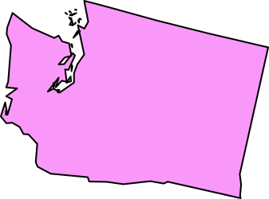

# Week 3: Membership has its privileges

This week we'll learn about keeping people out of and letting people into your members-only page. We're going to learn about:

- State
- Cookies
- Sessions
- Databases

## What is state?

We're all here in the state of Washington today, but that's not the kind of state I mean. Let me borrow the definition from the Wikipedia page about state:

> A program is described as **stateful** if it is designed to remember preceding events or user interactions the remembered information is called the **state** of the system.

Web pages and even web servers are not stateful by nature. They might know some information about your computer, browser, and connection, but that's being sent to them by your browser every time it asks them for something. Other than that, a basic web page or the server it's on isn't remembering if you've been there before or anything about you.

Basically, your browser is sending the server a request:

> Hi, I'm this kind of browser at this internet protocol address. Can you send me this file?

The server sends the file. End of story.

So how do we turn what we've created so far from stateless web pages into stateful web apps?

## Introducing cookies

Who wants to see a cookie?

Now that cookie might create a state of happiness, but it's not going to create state in your web app.

