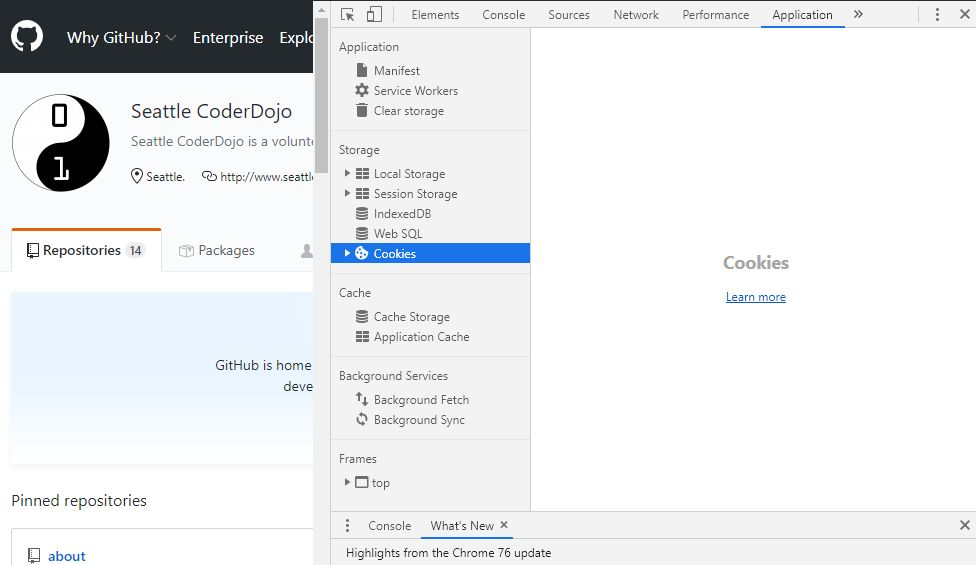
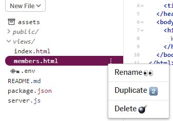

# Week 3: Membership has its privileges

This week we'll learn about keeping people out of and letting people into your members-only page. We're going to learn about:

- State
- Cookies
- Sessions
- Databases


## What is state?


We're all here in the state of Washington today, but that's not the kind of state I mean. Let me borrow the definition from the Wikipedia page about state:

> A program is described as **stateful** if it is designed to remember preceding events or user interactions the remembered information is called the **state** of the system.

A stateful program remembers stuff that happened before.

Web pages and even web servers are not stateful by nature. They might know some information about your computer, browser, and connection, but that's being sent to them by your browser every time it asks them for something. Other than that, a basic web page or the server it's on isn't remembering if you've been there before or anything about you.

Basically, your browser is sending the server a request:

> Hi, I'm this kind of browser at this internet protocol address. Can you send me this file?

The server sends the file. End of story.

So how do you turn what you've created so far from stateless web pages into stateful web apps? Well, first you feed the browser cookies.

## Introducing cookies

Who wants to see a cookie?


Now that cookie might create a state of happiness, but it's not going to create state in your web app.

Open your browser (at least Chrome, Firefox, or Edge) and press your F12 button on your keyboard. If you don't have one or it doesn't work, go to the menu and find "developer tools" or right-click in a web page and select inspect from the menu.

Take Github for example. Go to Github.com, open the developer tools in Chrome, and select the "Application" tab.



There, in the storage section is a selection called cookies. If you click the arrow next to it, you'll see an option for github.com, and if you click it, you'll see the cookies Github fed you.


It's fed you a number of cookies. Each one has a name and a value. There's a device ID, which is short. The `_gh_sess` value is really long (over 1,000 characters).

Why should you care about these? You had to use a special tool to even see them. Why did Github send them?

Because your browser will send them back. Now some it will keep for a long time and some it will forget the moment I close it. But whatever cookie the browser remembers the next time you send a request to Github, it will send to Github. And it will send those values *every* time.

## Feed yourself a cookie

Open up your projects from last week. If you're coming in fresh, you can clone my project at https://glitch.com/edit/#!/quilted-knee.

Once everyone's got their project open, open the views directory and click the little three-dot icon to the right of `members.html` and select "Duplicate."



It's going to ask you for a name and suggest `members.html copy`. Don't take its suggestion. Name it members-only.html.

To manage cookies yourself for this section of the tutorial, add the cookie parser module to the app.

First, go to the `package.json` file like last week and add the following line to the dependencies. 

Next, go to the `server.js` file. Under the `app.use(bodyParser.urlencoded({ extended: true }));` line where you're bringing in `bodyParser`, add these lines.

```javascript
var cookieParser = require('cookie-parser');
app.use(cookieParser());
```

Next, go to the `app.get` function you created for `/members` to serve up the `members.html` view. This is why this page was set up in a function. You can now check for a cookie whenever someone tries to load that page.

Here's the function you're starting with:

```javascript
app.get('/members', function(request, response) {
  response.sendFile(__dirname + '/views/members.html');
});
```

Here's how to update it:

```javascript
app.get('/members', function(request, response) {
  if (request.cookies.loggedIn === 'true') {
    response.sendFile(__dirname + '/views/members.html');    
  } else {
    response.sendFile(__dirname + '/views/members-only.html');
  }
});
```

On line two, you use an `if` statement, which tells the computer to only run the code between the curly braces if the code between the parentheses evaluates to true.

The code between the parentheses is `request.cookies.loggedIn !== 'true'`, checking the request object for a cookies object (which is put there by `cookie-parser`, and checking to see if it has a property called `loggedIn` with a value of 'true'). If it does, it sends the members page. If it doesn't, it sends the members-only page.

To test it, change "Welcome Friends" in members-only.html to "This is for members only."

Now show your project and add `/members` onto the end of the URL. If everything worked as planned, you should be getting told "This is for members only."


Okay, but how do you get to the members page?

You need a cookie. But how do you get one? 

Code up a URL that gives you one. Create a `cookieme` path in your app.

```javascript
app.get('/cookieme', function(request, response){
  response.cookie('loggedIn', 'true').send('Me give you cookie.');
})
```

The `response.cookie` function takes multiple arguments, but the only two you need are a name for the cookie and a value. Here the name is "loggedIn" and the value is "true." 

But since cookies are sent sort of behind the scenes, the browser will keep trying to load the page until it gets an actual response. By adding `send()` with a message as an argument, you're "chaining" the `response.send` function after `response.cookie` and telling the human looking at the browser "me give you cookie."


Now try to load the `/members` page. You should be welcomed.


