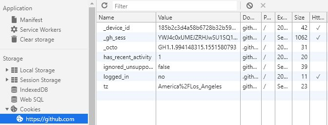
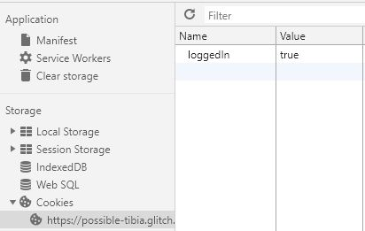
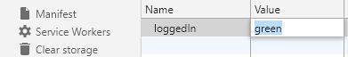
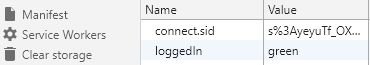

# Week 3: Membership has its privileges

This week we'll learn about keeping people out of and letting people into your members-only page. We're going to learn about:

- State
- Cookies
- Sessions
- Databases for longer sessions


## What is state?


We're all here in the state of Washington today, but that's not the kind of state I mean. Let me borrow the definition from the Wikipedia page about state:

> A program is described as **stateful** if it is designed to remember preceding events or user interactions the remembered information is called the **state** of the system.

A stateful program remembers stuff that happened before.

Web pages and even web servers are not stateful by nature. They might know some information about your computer, browser, and connection, but that's being sent to them by your browser every time it asks them for something. Other than that, a basic web page or the server it's on isn't remembering if you've been there before or anything about you.

Basically, your browser is sending the server a request:

> Hi, I'm this kind of browser at this internet protocol address. Can you send me this file?

The server sends the file. End of story.

So how do you turn what you've created so far from stateless web pages into stateful web apps? Well, first you feed the browser cookies.

## Introducing cookies

Who wants to see a cookie?


Now that cookie might create a state of happiness, but it's not going to create state in your web app.

Open your browser (at least Chrome, Firefox, or Edge) and press your F12 button on your keyboard. If you don't have one or it doesn't work, go to the menu and find "developer tools" or right-click in a web page and select inspect from the menu.

Take Github for example. Go to Github.com, open the developer tools in Chrome, and select the "Application" tab.


There, in the storage section is a selection called cookies. If you click the arrow next to it, you'll see an option for github.com, and if you click it, you'll see the cookies Github fed you.



It's fed you a number of cookies. Each one has a name and a value. There's a device ID, which is short. The `_gh_sess` value is really long (over 1,000 characters).

Why should you care about these? You had to use a special tool to even see them. Why did Github send them?

Because your browser will send them back. Now some it will keep for a long time and some it will forget the moment I close it. But whatever cookie the browser remembers the next time you send a request to Github, it will send to Github. And it will send those values *every* time.

## Feed yourself a cookie

Open up your projects from last week. If you're coming in fresh, you can clone my project at https://glitch.com/edit/#!/quilted-knee.

Once everyone's got their project open, open the views directory and click the little three-dot icon to the right of `members.html` and select "Duplicate."


It's going to ask you for a name and suggest `members.html copy`. Don't take its suggestion. Name it members-only.html.

To manage cookies yourself for this section of the tutorial, add the cookie parser module to the app.

First, go to the `package.json` file like last week and add the following line to the dependencies. 

Next, go to the `server.js` file. Under the `app.use(bodyParser.urlencoded({ extended: true }));` line where you're bringing in `bodyParser`, add these lines.

```javascript
var cookieParser = require('cookie-parser');
app.use(cookieParser());
```

Next, go to the `app.get` function you created for `/members` to serve up the `members.html` view. This is why this page was set up in a function. You can now check for a cookie whenever someone tries to load that page.

Here's the function you're starting with:

```javascript
app.get('/members', function(request, response) {
  response.sendFile(__dirname + '/views/members.html');
});
```

Here's how to update it:

```javascript
app.get('/members', function(request, response) {
  if (request.cookies.loggedIn === 'true') {
    response.sendFile(__dirname + '/views/members.html');    
  } else {
    response.sendFile(__dirname + '/views/members-only.html');
  }
});
```

On line two, you use an `if` statement, which tells the computer to only run the code between the curly braces if the code between the parentheses evaluates to true.

The code between the parentheses is `request.cookies.loggedIn !== 'true'`, checking the request object for a cookies object (which is put there by `cookie-parser`, and checking to see if it has a property called `loggedIn` with a value of 'true'). If it does, it sends the members page. If it doesn't, it sends the members-only page.

To test it, change "Welcome Friends" in members-only.html to "This is for members only."

Now show your project and add `/members` onto the end of the URL. If everything worked as planned, you should be getting told "This is for members only."


Okay, but how do you get to the members page?

You need a cookie. But how do you get one? 

Code up a URL that gives you one. Create a `cookieme` path in your app.

```javascript
app.get('/cookieme', function(request, response){
  response.cookie('loggedIn', 'true').send('Me give you cookie.');
})
```

The `response.cookie` function takes multiple arguments, but the only two you need are a name for the cookie and a value. Here the name is "loggedIn" and the value is "true." 

But since cookies are sent sort of behind the scenes, the browser will keep trying to load the page until it gets an actual response. By adding `send()` with a message as an argument, you're "chaining" the `response.send` function after `response.cookie` and telling the human looking at the browser "me give you cookie."


Now try to load the `/members` page. You should be welcomed.


## Cookie switching

So why make this more complicated? Why get into sessions and a user database?

Because cookies are not that secure. Remember how you looked at the Github cookies a little bit ago? Look at your Glitch site's cookies. Open up the developer tools the way you did before... Application tab... Cookies... [your site]...



Go back to server.js and change the required value of the cookie to see the members page to "green."

```javascript
  if (request.cookies.loggedIn === 'green') {
```

Back to being locked out...


But what if you double-clicked on the 'true' value of the cookie and changed it to green (by typing 'green' and hitting Enter)? 



Then you reload the page...


So you've created state, but you've created it in an insecure way. The user can see and change their `loggedIn` cookie so they can get into the members area.

## How do I protect my cookies?


One way developers protect user information is with **sessions**.

With a session, the server sets a session ID as a cookie value. That ID is unique for each visitor to your site. The server stores all sorts of information and associates it with that session ID. You don't know what names they're using, what values they're using, anything. You just know the session ID.

Now, in some advanced attacks, a hacker can steal your session ID and pretend to be you. But the more advanced session libraries use a number of ways to protect against that and make sure that the person/browser/computer combo that started the session is the same as the one using it.

This is why you should log out of sites when you're not using them. It closes the session.

## How do I make a session?

You ask very good questions. Take a look at how to do it with `express-session`.

You already added it to your `package.json` last week. Now you'll add it to the app and use it.

Under where you added `cookie-parser` add this:

```javascript
var session = require('express-session');
app.use(session(
  {
    'secret': 'you should change this',
    'resave' : false,
    'saveUninitialized': false
  }
));
```

The `require` function loads the module. Then the server `app` is told to use the functionality returned by executing the `session` function created by loading the module. And the session function is passed one argument of an object containing three properties.

The **`secret`** is like a password. It will be used as an encryption key for the sessions. Change it.

The **`resave`** and **`saveUnitialized`** options are there because they default to "true," but it's been determined they shouldn't. To avoid breaking everyone's software, the defaults haven't been changed (yet), but now the server throws warning messages every time it starts if you don't explicitly set a value for each of them.

## Change a cookie to a session

You don't have to add any new routes or functions to make use of the sessions. Just swap out the cookie code for the session code.

```javascript
app.get('/members', function(request, response) {
  if (request.session.loggedIn === 'true') {
    response.sendFile(__dirname + '/views/members.html');    
  } else {
    response.sendFile(__dirname + '/views/members-only.html');
  }
});
```

All you've done is swap `request.cookie.loggedIn` for `request.session.loggedIn`.

```javascript
app.get('/cookieme', function(request, response){
  request.session.loggedIn = 'true';
  response.send('You have been sessionized.')
})
```

In the `cookieme` route, instead of passing a cookie name and value to `response.cookie()`, you just set the `loggedIn` property of the `request.session` to the value. And you still need to end with `response.send()` so the browser knows you're done.

### See how this works

If you refresh  `/members`, you'll be unwelcome again. If you look at the cookies in the developer tools, you'll still have `loggedIn` and the value will still be `green`.

If you then go to `/cookieme`, and check your cookies, you'll see a new one (you may need to reload to see it) in the developer tools. 



The `connect.sid` cookie contains a session ID. That is used to get at all the data you have added to the `request.session` object for the user, but it cannot be used to change any of it.

Now go back to `/members` (you may need to reload) and you're .

## So, we're done, right? 

Not quite yet. Go back to `server.js` and change the message in the `cookieme` route's `response.send()` from "You have been sessionized" to "You have been sessionized, buddy."

Now refresh `/members`.


Wait. What? Weren't you just logged in? If you look in your cookies in the developer tools, you've still got that `connect.sid` cookie. Why aren't you logged in?

Without being saved to a "store," sessions are only in the app's memory. Every time the app is restarted, the memory is cleared and the sessions...

### poof

Glitch autosaves and starts your app over and over as you make changes. So changing that message caused your app to be restarted and all the information associated with that session ID disappeared.

### poof

You'll need to add another dependency to your `package.json` file. Add `"connect-session-sequelize": "^6.0.0"`. Remember to put a comma after the line where you added `cookie-parser`.

Between these two lines...

```javascript
var session = require('express-session');
app.use(session(
```

Add this block of stuff...


