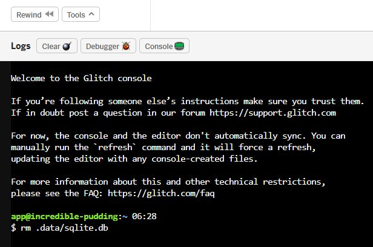

# WEEK 4: Our user management system


This week you're going to learn how to use a database to keep track of your users, including creating them, banning them, letting them change their passwords, and logging them in.

Along the way, you'll also learn about putting forms into web pages and submitting them.

Because this is an introductory course, this is not going to be as full-featured and secure as a user database would be if you were making a commercial project, but it will give you a good grasp of the concepts.

Today you'll learn:

1. What a database is.
3. How to create a new database and table.
4. How to add data to a database.
5. How to read data from a database.
6. How to use that data to let people in or keep them out

## What is a database?

Simply put, a database is a collection of information that you can read, search, add to, and change. You might have heard about MySQL or Oracle, maybe MongoDb.

Those aren't databases.

Let me repeat... **A database is a collection of information.** MySQL, Oracle, Mongo... each of those are a DbMS (Database Management System). They provide you with the tools to CRUD and do a lot more. 

### Wait a moment! Did he say CRUD?

While many modern DbMSs provide reporting functions and analysis functions and lots of shiny toys, there are four basic functions that are essential to managing a database.

- **C**reate records
- **R**ead records
- **U**pdate records
- **D**elete records

Create, read, update, delete... CRUD.

## What is SQL?

SQL can be pronounced as its individual letters, or like "sequel." It stands for "Structured Query Language," but a long time ago it used to be "Structured English Query Language" and that's when people started calling it "Sequel." Either way of saying it is fine.

In SQL, every request to a database is a QUERY, and SQL is the set of guidelines for how to write it to CRUD properly.

### Building a table

SQL is made up of databases (the collections of information), tables (structures for organizing the data), and fields (labeled spots to store the data).

The tables are much like a table you'd see in a spreadsheet. In fact, a lot of people use spreadsheets as basic databases.


This is a spreadsheet table that looks sort like your user database will. We have the person's first name, last name, their password (which we've protected from snooping) and a field saying whether or not they're an administrator.

In a SQL table, each field will have a name and a "datatype." The datatype says the kind of information the field will hold. For "First Name," it would be a string, because a sequence of letters is a string. For "Administrator," it's a Boolean (a true or false value). We assign datatypes to fields so the DBMS knows not to put the wrong kind of information there. If we're expecting the value to be true or false, things will break if the value is "hedgehog."


## Create a database

Wait, didn't you already create a database? Yes, you created one for session persistence. But databases are collections of information. 

The database that contains sessions should be its own thing.

The database that runs core site functions like users and messaging should be its own thing.

First open your project from last week. If you lost it or broke it, you can use [possible-tibia](https://glitch.com/edit/#!/possible-tibia), the finished level from last week. Remember, after you open it, to click the project name in the upper left corner and select "Remix Project."

The session store database is `storeHolder`.  

See how it's created?

```javascript
var storeHolder = new Sequelize({
  dialect: 'sqlite',
  storage: './.data/sqlite.db'
});
```

Make a duplicate of that (meaning you should have two copies), but change the name on one of them from `storeHolder` to `siteDb`. Remember, capitalization is important. 

This is exciting, but there's very little to do.

## Set up the user table

Remember the table above. For the main user table you just need to store 3 things: `userName`, `password`, and `admin`.  Add this in below the end of the `app.use(session...` function.

```javascript
//set up users table
const Users = siteDb.define('users', {
  // attributes
  user_name: {
    type: Sequelize.STRING,
    allowNull: false,
    unique: true
  },
  password: {
    type: Sequelize.STRING,
    allowNull: false
  },
  admin: {
    type: Sequelize.BOOLEAN,
    allowNull: false
  }
});
```

You're creating a variable called `Users` which will contain a pointer to the table. It's going to call the `define()` function of the database you created. The first argument of the function sets the table name: `users`. 

The second argument tells it the fields to create. **Every** table will get `id`, `createdAt`, and `modifiedAt` fields set automatically, so you don't need to define those. You want to give it a name for the field, and then as properties of the field, the datatype and whether to allow it to have no value at all.

The fields for `username` and `password` are set to `Sequelize.STRING`. That's a value that can be 1 to 255 characters. The field for `admin` is a boolean, just true or false. 

All of the fields have an additional property of `allowNull` that's set to `false` (it's a boolean!). When you set that, if you try to create a record in the database with one of those fields empty, you'll get an error.

And the `user_name` field also has a property of `unique` that is set to `true`. This is to make sure you don't get two users with the same exact username. You could check it manually every time you created a user, but this will cause an error if you try to create a record for a user name that already exists. 

Last, below the `storeHolderSync();` line (just below the function you made to create the table), add another line.

```javascript
siteDb.sync();
```

This is a really useful function. It checks to see if the table exists, and if not, it creates it.

Let's stop and check the logs. Your most recent log should look like this:

```javascript
🍴🎆 Your app is listening on port 3000
Executing (default): CREATE TABLE IF NOT EXISTS `Sessions` (`sid` VARCHAR(36) PRIMARY KEY, `expires` DATETIME, `data` TEXT, `createdAt` DATETIME NOT NULL, `updatedAt` DATETIME NOT NULL);
Executing (default): CREATE TABLE IF NOT EXISTS `users` (`id` INTEGER PRIMARY KEY AUTOINCREMENT, `userName` VARCHAR(255) NOT NULL, `password` VARCHAR(255) NOT NULL, `admin` TINYINT(1) NOT NULL, `createdAt` DATETIME NOT NULL, `updatedAt` DATETIME NOT NULL);
Executing (default): PRAGMA INDEX_LIST(`Sessions`)
Executing (default): PRAGMA INDEX_LIST(`users`)
Executing (default): PRAGMA INDEX_INFO(`sqlite_autoindex_Sessions_1`)
```

## Create your admin user

Normally, if I was doing this with PHP and MySQL, I'd be using a tool called phpMyAdmin to build my table and insert the first user. But because we don't have that tool, we have to write code for it in our app.

The code will:

- Check to see if the admin user exists
- If not, add the user and their password

Now, the LAST thing you want to do is put your admin user's user name and password right into the code that everyone can see and everyone can clone. For sensitive stuff like that, you store it in your `.env` file.


See there's a key next to the name of the file? This is a secure storage area. I can go look at your code, but I can't look at this file. If I remix your code, this file will not have your values in it. Go to `.env` and add in the `ADMIN_USER` and `ADMIN_PW` variables with values you choose. **Beware** of the warning. There can't be spaces around the `=` symbol.

Got that? Good. Go back to `server.js` and scroll all the way to the end. You'll be creating some helper functions and they can go toward the end. Next week, when you create your message board, you'll actually create a module to hold the message board functions.

### Create a `getUser()` function

Create a function that asks the database for any records matching a specific user name.

```javascript
function getUser(user) {
   return Users.findAll({
       where: {
           'user_name': user
       }
   }); 
}
```

You've declared the name of the function is `getUser` and it takes an argument of `user`. Whatever value is passed as the argument when you call `getUser()` will be available in the function as the variable `user`.

Remember how you assigned the table to `Users`? Now you'll query the table to return the result of a `findAll()` request `where` the record has a value in the `user_name` field that's the same as the one you passed as an argument.

### Create an `addUser()` function

Before you create the function to add a user, let's talk about security. Never, ever, never, never, never, ever store passwords in plain text. Passwords should always be encrypted or hashed before you store them in the database.

**Encryption:** When it's used here, it's referring to a 2-way encryption. With the right encryption key, you can decrypt it.

**Hashing:** Used here, it's a 1-way encryption that tries to create a unique value, but in a way that you can hash the same value multiple times and check those hashes against each other to ensure they were hashed from the same value.

The reason to hash a password is if a hacker gets your user database, they don't get anyone's actual password and it takes a LOT of raw computing power to brute force a good hash back into the original string. When a user submits their username and password, you hash the password they submitted and compare it to the hash you stored.

WAY back in the first week, you added `bcrypt` as a dependency in your `package.json` file. Now it's time to use it.

Scroll up to the top of `server.js` and add this line at the bottom of the `// init project` section.

```javascript
var bcrypt = require('bcrypt');
```

Now scroll back down to the bottom and create the `addUser()` function. 

```javascript
function addUser(user, pw, is_admin){
  //first, hash the password
  pw = bcrypt.hashSync(pw, 6);
  // findOrCreate checks if the user exists and creates them if they don't
  return Users.findOrCreate({
    where: {
	  'user_name': user
	  }, 
	defaults: {
	  'password': pw,
	  'admin': is_admin
    }
  });
}
```

Here you're taking three arguments: the user name, the password, and a value for is_admin.

First, you use `bcrypt` to hash the password. You call the function `hashSync` and give it two arguments: the password and a number of how many times it should run its function to make it unrecognizable. 

The number of times it runs is actually 2 to the power of that number. So 2 is actually 4 times, 6 is 64 times, and a lot of people go for 12, which is 4096 times. But since these aren't really powerful servers, 4096 could take a while.

Then you use that to run the `findOrCreate` function from the `Users` table object and return the results. 

Besides specifying that `user_name` should be unique when you created the table, when you add users, `findOrCreate` only adds that record if there isn't a record that matches the `where` condition. It's like a double-check for added protection.

The argument passed to `findOrCreate` is an object with two child objects. One, assigned to `where` is the condition it should check, just like when it's getting a user. The others (`defaults`) are things we want added, but not checked against other records.

### Create a dbInit() function

To bring together everything you've done to make the databases. Take the `sync` commands from under the `// set up / sync the session store` line and put them in a function that will pull together setting up both tables and the admin user.

```javascript
async function dbInit(){  
   //make sure we have a database, a table, and an admin user
  await storeHolder.sync(); 
  await siteDb.sync();
  await addUser(process.env.ADMIN_USER, process.env.ADMIN_PW, true);
}
```

Here's a new concept, the keywords of `async` and `await`. In Node, a lot of things happen when they happen. That's asynchronous execution... they don't need to be in sync. Instead of returning the information you want, they often return a 'promise'. It's an IOU for the information.

Sequelize is designed to return promises.

By declaring the function as `async`, you can make any other function call within it `await` the fulfillment of a promise, so they actually get completed in order and one doesn't start until another finishes. You want your databases and tables to get made on the first run before you try to add a user to them, right?

A lot of people will tell you not to use async/await, because it slows down Node while it waits for things to finish. But when it's part of your server start-up, it's totally okay.

Where you had the sync functions, just put a call to dbInit.

```javascript
// set up / sync the session store
dbInit();
```

Check your logs to make sure nothing's breaking.

### Create a verifyUser() function

Last but not least, you need to be able to make sure the user name and password are correct.

```javascript
async function verifyUser(user, pw){
  //set up a default response
  var response = {
    logged_in: false,
    admin: false,
    error_msg: "No record of this user/password combo exists."
  }

  //search for the user
  var user = await getUser(user);
  if(user.length === 0){
    return response;
  }
  
  // check the password
  if(bcrypt.compareSync(pw, user[0].password)){
    response.logged_in = true;
    response.admin = user[0].admin;
    response.error_msg = "";
  }
  
  return response;
 
}
```

You start by creating a default response. It's an object with three properties... whether the user should be logged in, whether they should be recognized as an administrator, and the default error message if neither is true.

The `getUser()` function returns an array. If there are no matches, it will be empty and the length will be zero. Returning the default response then actually ends execution of the function, so computing power isn't wasted on computing and checking hashes.

Next you use `bcrypt`'s `compareSync` function. The `bcrypt` library has both synchronous and asynchronous ways of doing things. To keep things simple, we'll take the synchronous route and wait until it's done to proceed. 

Use the function to check the password hash in the user record that was returned against the password that was submitted. If it passes, it sends a response with the user logged in and the admin value from their record. For good measure, erase the error message.

And if the password doesn't match, return the defaults.


## Pause to sync and get current

YAAAAAY! That was a long slog of writing code that didn't do anything you could watch and ooh and ahhh at. But now it's time to write a login page and a logout page.

If we decided in Dojo to speed through all that, now is the time to go do three things:

1. Open the "Week 4 - Working Copy 1" project at [incredible-pudding](https://glitch.com/edit/#!/incredible-pudding).
2. Don't remix it. Just copy the contents of `server.js` from that project to yours.
3. Make sure to go set the `ADMIN_USER` and `ADMIN_PW` values in your `.env` files for the admin user name and password.

If you've been sort of following along. You might have created a user database with bad data in it. You can delete the whole shebang by opening your logs, clicking the `Console` button, and entering this command.

```bash
rm .data/sqlite.db
```



It's okay, because the next time you run your app, all your tables will be re-created and right now the only user whose data would be lost is the administrative user, and they'll be re-created too.

## Create login and logout pages

The easy part is the logout page.

Go back up to the `/cookieme` route you created last week. Change "cookieme" to "logout."

```javascript
app.get('/logout', function(request, response){
  request.session.loggedIn = 'false';
  request.session.admin = 'false'
  response.send('You have been sessionized, pal.')
})
```

Change the logged in value to `false`, add a line to change the `admin` value to false. And they're logged out.

A harder part is the login page. We're going to create a login form and a route to handle the submission.

Go back to the views folder and open `members-only.html`. Update it to this.

```html
<!DOCTYPE html>
<html>
  <head>
    <title>Members ONLY!</title>
  </head>
  <body style="padding: 25px;">
    <h1>
      This is for members only.
    </h1>
    <h2>
      Please login.        
    </h2>      
    <form action="/login" method="post">
      <p>
        <strong>User name:</strong><br>
        <input type="text" name="user" size="30">
      </p>
      <p>
        <strong>Password:</strong><br>
        <input type="password" name="password" size="30">
      </p>
      <p>
        <input type="submit" value="Submit">
      </p>
    </form>
  </body>
</html>
```

This adds a `form` element to the page people are sent to when they're not logged in. It has the attributes of `action`, which is generally the URI it should send the form results to, and `method`, which is usually `get` or `post`.

**Get:** Puts the form data in the URL... http(s)://mything.com?username=bob&password=mypassword

**Post:** Puts the form data in the request header. Also makes it easier to submit files and other large items.

Although using HTTPS (secure HTTP) like Glitch does will encrypt everything after `?` in the URL, it's generally considered safer to put passwords in a `post` method.

We also have three input types:

**Text:** Exactly what you think it is.

**Password:** Like text, but obscures what's being typed so people can't peek over your shoulder.

**Submit**: Gives you a button with the "value" on it.

## Creating a login handler

Right under the `app.get()` for the logout, let's create an `app.post()` for the login.

```javascript
app.post('/login', async function(request, response){
  var status = await verifyUser(request.body.user, request.body.password);
  if(status.logged_in === true){
    request.session.loggedIn = 'true';
	request.session.admin = status.admin;
	// commenting out the admin redirect for now
	//if(status.admin == true) {
    //  response.redirect(302, "/admin");
    //}
   }
	response.redirect(302, "/members");
})

```

The path is the `/login` the form is using. The handler function is async because you can't log the user in and redirect them until you get the results of their verification. There are ways to do that asynchronously so  your web site would be faster under a heavier load, but this is already pretty complicated, so let's keep this part simple.

The `verifyUser()` results are checked. If the login is successful, the session is updated. If not, it's not. Then the user is sent back to the /members path to have their session checked again. 

If they logged in, they'll go to the members page. If not, back to the form.

Let's get this working.

## NEXT WEEK

We built a LOT of concepts and a lot of foundation this week. That should enable us to set up an error message for unsuccessful logins, an admin page for managing users, and add a simple message board to your members page by the end of next week.