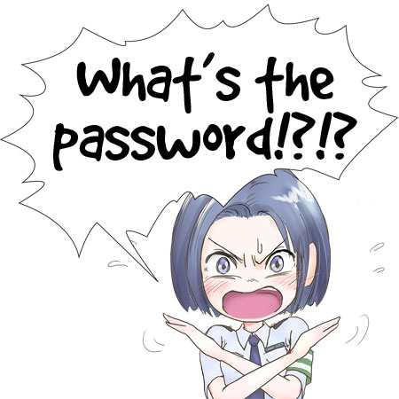
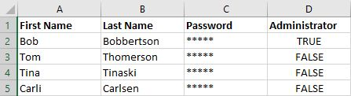
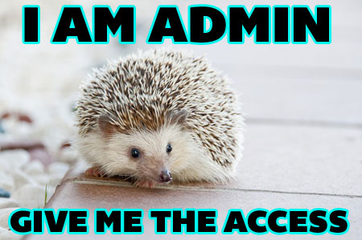

# WEEK 4: Our user management system

This week you're going to learn how to use a database to keep track of your users, including creating them, banning them, letting them change their passwords, and logging them in.

Along the way, you'll also learn about putting forms into web pages and submitting them.

Because this is an introductory course, this is not going to be as full-featured and secure as a user database would be if you were making a commercial project, but it will give you a good grasp of the concepts.

Today you'll learn:

1. What a database is.
2. What SQL is.
3. How to create a new database and table.
4. How to add data to a database.
5. How to read data from a database.
6. How to change data in a database.

## What is a database?

Simply put, a database is a collection of information that you can read, search, add to, and change. You might have heard about MySQL or Oracle, maybe MongoDb.

Those aren't databases.

Let me repeat... **A database is a collection of information.** MySQL, Oracle, Mongo... each of those are a DbMS (Database Management System). They provide you with the tools to CRUD and do a lot more. 

### Wait a moment! Did he say CRUD?

While many modern DbMSs provide reporting functions and analysis functions and lots of shiny toys, there are four basic functions that are essential to managing a database.

- **C**reate records
- **R**ead records
- **U**pdate records
- **D**elete records

Create, read, update, delete... CRUD.

## What is SQL?

SQL can be pronounced as its individual letters, or like "sequel." It stands for "Structured Query Language," but a long time ago it used to be "Structured English Query Language" and that's when people started calling it "Sequel." Either way of saying it is fine.

In SQL, every request to a database is a QUERY, and SQL is the set of guidelines for how to write it to CRUD properly.

### Building a table

SQL is made up of databases (the collections of information), tables (structures for organizing the data), and fields (labeled spots to store the data).

The tables are much like a table you'd see in a spreadsheet. In fact, a lot of people use spreadsheets as basic databases.

This is a spreadsheet table that looks sort like your user database will. We have the person's first name, last name, their password (which we've protected from snooping) and a field saying whether or not they're an administrator.

In a SQL table, each field will have a name and a "datatype." The datatype says the kind of information the field will hold. For "First Name," it would be a string, because a sequence of letters is a string. For "Administrator," it's a Boolean (a true or false value). We assign datatypes to fields so the DBMS knows not to put the wrong kind of information there. If we're expecting the value to be true or false, things will break if the value is "hedgehog."

Setting up your user table with your first user

Creating a login page and adding session vars

Creating a logout function

Creating an admin page

Add user

Boot user

Let user change password & update profile

Kids grant each other perms