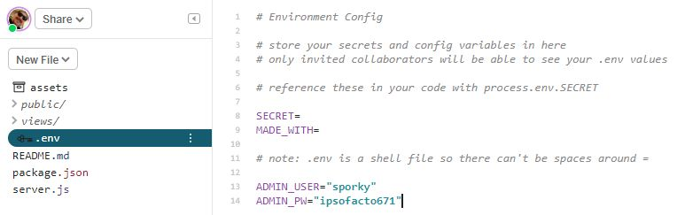

# WEEK 4: Our user management system


This week you're going to learn how to use a database to keep track of your users, including creating them, banning them, letting them change their passwords, and logging them in.

Along the way, you'll also learn about putting forms into web pages and submitting them.

Because this is an introductory course, this is not going to be as full-featured and secure as a user database would be if you were making a commercial project, but it will give you a good grasp of the concepts.

Today you'll learn:

1. What a database is.
2. What SQL is.
3. How to create a new database and table.
4. How to add data to a database.
5. How to read data from a database.
6. How to change data in a database.

## What is a database?

Simply put, a database is a collection of information that you can read, search, add to, and change. You might have heard about MySQL or Oracle, maybe MongoDb.

Those aren't databases.

Let me repeat... **A database is a collection of information.** MySQL, Oracle, Mongo... each of those are a DbMS (Database Management System). They provide you with the tools to CRUD and do a lot more. 

### Wait a moment! Did he say CRUD?

While many modern DbMSs provide reporting functions and analysis functions and lots of shiny toys, there are four basic functions that are essential to managing a database.

- **C**reate records
- **R**ead records
- **U**pdate records
- **D**elete records

Create, read, update, delete... CRUD.

## What is SQL?

SQL can be pronounced as its individual letters, or like "sequel." It stands for "Structured Query Language," but a long time ago it used to be "Structured English Query Language" and that's when people started calling it "Sequel." Either way of saying it is fine.

In SQL, every request to a database is a QUERY, and SQL is the set of guidelines for how to write it to CRUD properly.

### Building a table

SQL is made up of databases (the collections of information), tables (structures for organizing the data), and fields (labeled spots to store the data).

The tables are much like a table you'd see in a spreadsheet. In fact, a lot of people use spreadsheets as basic databases.


This is a spreadsheet table that looks sort like your user database will. We have the person's first name, last name, their password (which we've protected from snooping) and a field saying whether or not they're an administrator.

In a SQL table, each field will have a name and a "datatype." The datatype says the kind of information the field will hold. For "First Name," it would be a string, because a sequence of letters is a string. For "Administrator," it's a Boolean (a true or false value). We assign datatypes to fields so the DBMS knows not to put the wrong kind of information there. If we're expecting the value to be true or false, things will break if the value is "hedgehog."


## Create a database

Wait, didn't you already create a database? Yes, you created one for session persistence. But databases are collections of information. 

The database that contains sessions should be its own thing.

The database that runs core site functions like users and messaging should be its own thing.

First open your project from last week. If you lost it or broke it, you can use [possible-tibia](https://glitch.com/edit/#!/possible-tibia), the finished level from last week. Remember, after you open it, to click the project name in the upper left corner and select "Remix Project."

The session store database is `storeHolder`.  

See how it's created?

```javascript
var storeHolder = new Sequelize({
  dialect: 'sqlite',
  storage: './.data/sqlite.db'
});
```

Make a duplicate of that (meaning you should have two copies), but change the name on one of them from `storeHolder` to `siteDb`. Remember, capitalization is important. 

This is exciting, but there's very little to do.

## Set up the user table

Remember the table above. For the main user table you just need to store 3 things: `userName`, `password`, and `admin`.  Add this in below the end of the `app.use(session...` function.

```javascript
//set up users table
const Users = siteDb.define('users', {
  // attributes
  user_name: {
    type: Sequelize.STRING,
    allowNull: false,
    unique: true
  },
  password: {
    type: Sequelize.STRING,
    allowNull: false
  },
  admin: {
    type: Sequelize.BOOLEAN,
    allowNull: false
  }
});
```

You're creating a variable called `Users` which will contain a pointer to the table. It's going to call the `define()` function of the database you created. The first argument of the function sets the table name: `users`. 

The second argument tells it the fields to create. **Every** table will get `id`, `createdAt`, and `modifiedAt` fields set automatically, so you don't need to define those. You want to give it a name for the field, and then as properties of the field, the datatype and whether to allow it to have no value at all.

The fields for `username` and `password` are set to `Sequelize.STRING`. That's a value that can be 1 to 255 characters. The field for `admin` is a boolean, just true or false. All of the fields have an additional property of `allowNull` that's set to `false` (it's a boolean!). When you set that, if you try to create a record in the database with one of those fields empty, you'll get an error.

Last, below the `storeHolderSync();` line (just below the function you made to create the table), add another line.

```javascript
siteDb.sync();
```

This is a really useful function. It checks to see if the table exists, and if not, it creates it.

Let's stop and check the logs. Your most recent log should look like this:

```javascript
🍴🎆 Your app is listening on port 3000
Executing (default): CREATE TABLE IF NOT EXISTS `Sessions` (`sid` VARCHAR(36) PRIMARY KEY, `expires` DATETIME, `data` TEXT, `createdAt` DATETIME NOT NULL, `updatedAt` DATETIME NOT NULL);
Executing (default): CREATE TABLE IF NOT EXISTS `users` (`id` INTEGER PRIMARY KEY AUTOINCREMENT, `userName` VARCHAR(255) NOT NULL, `password` VARCHAR(255) NOT NULL, `admin` TINYINT(1) NOT NULL, `createdAt` DATETIME NOT NULL, `updatedAt` DATETIME NOT NULL);
Executing (default): PRAGMA INDEX_LIST(`Sessions`)
Executing (default): PRAGMA INDEX_LIST(`users`)
Executing (default): PRAGMA INDEX_INFO(`sqlite_autoindex_Sessions_1`)
```

## Create your admin user

Normally, if I was doing this with PHP and MySQL, I'd be using a tool called phpMyAdmin to build my table and insert the first user. But because we don't have that tool, we have to write code for it in our app.

The code will:

- Check to see if the admin user exists
- If not, add the user and their password

Now, the LAST thing you want to do is put your admin user's user name and password right into the code that everyone can see and everyone can clone. For sensitive stuff like that, you store it in your `.env` file.



See there's a key next to the name of the file? This is a secure storage area. I can go look at your code, but I can't look at this file. If I remix your code, this file will not have your values in it. Go to `.env` and add in the `ADMIN_USER` and `ADMIN_PW` variables with values you choose. **Beware** of the warning. There can't be spaces around the `=` symbol.

Got that? Good. Go back to `server.js` and scroll all the way to the end. You'll be creating some helper functions and they can go toward the end. Next week, when you create your message board, you'll actually create a module to hold the message board functions.

### Create a `getUser()` function

There are two main ways to declare a function. One is to use the `function` keyword and declare a name. The other is to create a variable with the name you want and add an unnamed function to it. For `getUser()` you'll do it the first way.

```javascript
function getUser(user) {
   return Users.findAll({
       where: {
           'user_name': user
       }
   }); 
}
```

You've declared the name of the function is `getUser` and it takes an argument of `user_name`. Whatever value is passed as the argument when you call `getUser()` will be available in the function as the variable `user_name`.

Remember how you assigned the table to `Users`? Now you'll query the table to return 

### Create an `addUser()` function


Creating a login page and adding session vars


Creating a logout function


Creating an admin page

Add user


Boot user


Let user change password & update profile


Kids grant each other perms