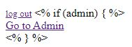
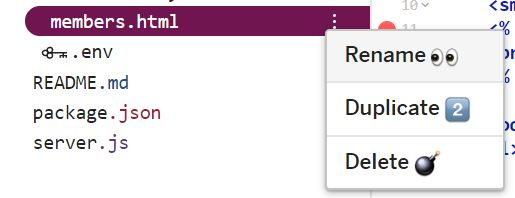
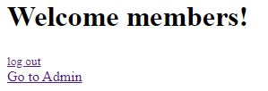
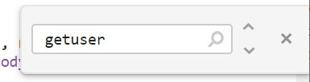
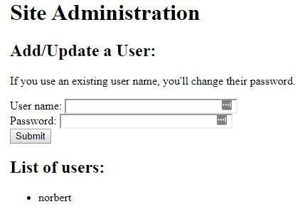

# Week 5: Let's chat

Last week you got your user database set up, methods to add and verify users, and created an administrative user with Admin powers.

Now it's time to put all that to work. You need an admin page to create, modify, and delete user accounts for your friends. Then you need a message board in your ***private*** members-only area where you and your friends can chat.

First some housekeeping.


Load up your [glitch.com](https://glitch.com) project. If you need a working copy of where we left off, but you want to preserve your "About Me" page, do this.

> * Open two windows.
>
> * In one window open your project.
>
> * In the other window, open [thorn-salute](https://glitch.com/edit/#!/thorn-salute).
>
> * Remix thorn-salute.
>
> * Copy your index.html file contents from your project, and replace the contents of index.html in your thorn-salute remix with it.
>
> * Copy your style.css file contents from your project and replace the contents of style.css in your thorn-salute remix with it.
>
> * Go to .env. Set a new username and password for your admin user, like:
>
>   ```javascript
>   ADMIN_USER="sporky"
>   ADMIN_PW="flanksteak8"
>   ```
>
>   Only not those, because they're in this file, and hackers could try them. Make up your own.
>
> * Click the "Tools" button, select "Full Page Console," and in the console window, type:
>
>   ```bash
>   rm .data/sqlite.db
>   ```
>
>   This will delete any database you might have created with an admin user whose name is blank and password is blank.

Now we're ready to move on.

## Make a logout link

A lot of you couldn't remember what the logout URL was last week or found it painful to edit the URL to go to it. So let's do two things.

1. Let's add a return to the Members page from the logout. In your `index.js` file, find your logout function. The line looks like `app.get("/logout", function(request, response) {` and should be around line 88.

   - For the last line where it responds with "You have been logged out." change that line to:

     ```javascript
     response.send("You have been logged out.  <a href='/members'>Go back</a>.");
     ```

     It's pretty simple, really. You learned about links in week 1. We're just adding a link to go back to the members section.

2. In your members.html file in the `views/` directory, add a logout link. Before `</body>` add a couple of blank lines. Under `</h1>` (AFTER your "h1" header section containing "Welcome members!") add this line.

   ```html
   <small><a href="/logout">log out</a></small>
   ```

   And that will let you click to log out.

Let's try that. 

1. Go to your members page. Log in. 
2. You should get "Welcome members!" and a "log out" link in much smaller text.
3. Click the link to log out. Click the link to go back.
4. You should see the login form again. If you don't, try refreshing the page. 

## Wait. Is it 'log in' and 'log out' or 'login' and 'logout'?

This question comes up a lot in tech, and knowing the answer will make you look smart.


The verb (action) is two words and the noun (thing) is one word. This is the rule for all official AWS documentation.

So you go to the login to log in. And you go to the logout to log out. 

Or, put another way, if you're telling people what to do, it's two words. If you're tell them where to go, it's one.

## Let's make an Admin Page

Every user database needs an administration page. It's where the person (or people) with administrator permissions can do things to set policies, create/edit/delete accounts, etc.

How else are you going to let your friends view and have access to your site? I mean you could add them all like you wrote code to add the admin account. But that gets messy and can be a security issue.

We need to put your friends in The Matrix.


Let's create a skeleton admin page.

First, in your `views/` directory, let's create a route for the admin page. But since we don't want people to be able to guess it easily, we'll name the route `mintyfresh`. There's no reason. It's just easy to remember, but not `admin`.

In your index.js file, let's create that route above the logout route we recently edited, between it and the members route. Actually, we'll need to restrict who can see the admin page, so let's copy the members route to get some of that functionality right away. 

We want to make three changes:

1. **In the copy** change `/members` in the `app.get` line to `mintyfresh`.

2. **In the copy** change the `if` line from:

   ```javascript
   if (request.session.loggedIn === "true") {
   ```

   To:

   ```javascript
   if ((request.session.loggedIn === "true") && (request.session.admin === true)) {
   ```

   You'll note that we've got more parentheses and some ampersands.

   The `if ()` operator tests the value of what's between the parentheses. So if you want to test more than one thing in a connected way, you put each thing between parentheses and put a Boolean connector between them.

   For the `if ()` to be true and execute the code after it, the rule is...

   `if ((A) && (B))` - Both A and B must be true for it to execute the code.

   `if ((A) || (B))` - As long as one of them is true it will execute the code.

   So we're saying that the user has to be both logged in AND (&&) an administrator for it to display the page. Or else it will send them back to the login page.

   Note also that one "true" is in quotes and one isn't. That's because in the login, we set the `loggedIn` value to the *word* 'true', but we set the `admin` value to the *Boolean value* of true. I could say this was on purpose to teach you the difference, but it was because I'm sometimes up late writing this and I should have used the Boolean value in both places. But it would make things more complicated to fix it, so we'll live with it for now.

3. **In the copy** change `members.html` to `admin.html`

Why are we naming the file admin.html, but the route to `mintyfresh`? No one but you will see the file name and it's easier for you to know what it does.

Now let's create that admin.html file in `views/`.

Click the "New File" button, set the value to "views/admin.html",  and click the "Add This File" button.

In the resulting `admin.html` file, just put in some text to let you know you're there like "I am admin."

## Let's start using templates

We'll use a template engine to fill in the user list for the admin page, the posts for the message board, and we'll start off with a simple task: creating a conditional link to the admin page.

#### What does a template engine do?

It's going to take the HTML pages we use in our routes and replace bits in them (template variables) with content we specify in our server code.

#### What's a conditional link?

We're going to use the template engine to replace a variable with a link to the admin page, but only if the user is an administrator.

#### How do I add a template engine?

Let's first add a template engine to our app. We'll use a module called EJS. And how do we add a module?

Right! We go edit the `package.json` file. In the `dependencies` object, we'll add:

```json
"ejs": "^2.7.1"
```

Don't forget to add a comma at the end of the line before it or you'll get an error.

Then let's go to the top of `index.js` and add a requirement for EJS and add it to the app.

After where you add `bcrypt` (around line 12), add these two lines.

```javascript
var ejs = require('ejs');
app.set('view engine', 'ejs');
```

Before, we used `app.use` to sort of add random things. But Express has special functionality for templating engines. In fact it supports many. So in this case, we're setting a value of which "view engine" to use.

#### Let's add a template variable to the members page

Open up the `members.html` page.

Under the logout link add this.

```html
<% if (admin) { %>
    <br><a href="/mintyfresh">Go to Admin</a><br>
<% } %> 
```

This is a conditional operator for EJS. We're actually sort of putting some JavaScript in two tags with percentage marks around it. `<% [my javascript] %>`. Ours checks if a variable named `admin` is true. if so, it prints the HTML into the page it sends to the browser. If not, it skips printing it.

If we go to the members page, it will show much like it's typed.



This is because we're still just sending the plain HTML file, not the rendered template. 

#### How do you make it render?

Now that you have template variables, EJS will want a file name ending in `.ejs`. So you'll need to change the name of `members.html` to `members.ejs`. Do you remember how to do this on Glitch?

Hoer over the file and it will highlight with a stack of three dots to the right. Click on that stack and you'll get some options.



Select "Rename" and you'll be able to change the file name to `members.ejs`.

Next, go to the route for the members page.

Change this:

```javascript
response.sendFile(__dirname + "/views/members.html");
```

To this:

```javascript
    response.render(__dirname + "/views/members.ejs", {
      admin: request.session.admin
    });
```

Instead of just sending the file, we're now rendering the template. 

If we reload our members page, it looks like this:



But if we click the "Go to Admin" link it just goes to a page that says "I am Admin."

## Make the admin page do something

For our Admin page, we'll want three functions:

1. List users
2. Add/Edit user

I was going to add a function to delete users, but we're running long and changing someone's password without telling them is almost as good as deleting them.


To list our users, we'll want some way of getting information from the database into the page. We've got a templating engine. Rather than build this page bit by bit, change the name of `admin.html` to `admin.ejs` and copy this in.

```html
<!DOCTYPE html>
<html>
  <head>
    <title>My Admin Page</title>
  </head>
  <body style="padding: 25px;">
  <H1>
    Site Administration
 </H1>
    
<h2>
  Add/Update a User:
</h2>
  If you use an existing user name, you'll change their password.
  <form action="/admin-adduser" method='post'>
    <p>
      User name: <input type=text name='username' size='30'><br>
      Password: <input type=text name='password' size='30'><br>
      <input type=submit value="Submit">
    </p>
    </form>

<h2>
  List of users:
    </h2>
    
 <ul>
  <% users.forEach(function(user){ %>
   <li><%=user.user_name %></li>
  <% }); %>
</ul>
    
  </body>
</html>
```

We have a form that will post a username and password to a route we'll write soon to create the new user accounts for your friends. Then we have a list of users.

We pass the array of database results to EJS. Do you remember what an array is? 

It's a stack of values all in one variable. This array is a stack of user objects from the database, with `forEach()`, we'll pass them to a function one at a time as the variable `user`. Then that function prints the HTML and we can substitute parts of it with "template variables."

Those places where we use `<%=user.user_name %>`, EJS will replace that with the value in the `user_name` property of the `user` object. And it will do it once for each object.

This is going to break if you try to view the `mintyfresh` route because it's still looking for a `.html` file, and once we tell it to look for a `.ejs` file, it still needs the `users` array. We're going to need to update the route.

Change the original route to this.

```javascript
app.get("/mintyfresh", async function(request, response) {
  if ((request.session.loggedIn === "true")&&(request.session.admin === true)) {
    var users = await getUsers();
    console.log('we have users:')
    console.dir(users);
    response.render(__dirname + "/views/admin.ejs", {
      "users": users
    });
  } else {
    response.sendFile(__dirname + "/views/members-only.html");
  }
});
```

It will still break, because we have no `getUsers()` function to get that array of users. We do have a `getUser()` function. Maybe that will help us write the `getUsers()` function. Type `control`+`f` to open Glitch's find function and type `getuser` (It's not case sensitive). 



Click the down-arrow in the find box until you find... 

```javascript
function getUser(user) {
```

That's taking an argument of a user name and then doing a `findAll` search for all users with that name.

What if we edit that function to take no argument and no `where` condition, so it really finds ALL? Go down after the final end curly brace of the `getUser()` function and add a function. Together they should look like. Remember, you already have the first one. You just want to add the second one after it.

```javascript
function getUser(user) {
  //return an array of all users with the user_name field equalling user
  return Users.findAll({
    where: {
      user_name: user
    }
  });
}

function getUsers() {
  //return an array of all users
  return Users.findAll();
}
```

At this point your Admin page should display without error. Mine looks like...



Okay, what are we forgetting. We need to add or update users.

We have an `addUser()` function. Now we need an `editUser()` function. Let's add this under the `addUser` function.

```javascript
async function updateUser(user, password){
  //update the password and go
  var pw = bcrypt.hashSync(password, 6);
  return await Users.update({ 
    'password': pw
  }, {
    where: {user_name: user},
  });
}  
```

It will take the user name and new password as an argument. Update the password for that username, then return an array with the number of users who were affected as its first element.

Now we need an `admin-adduser` route to handle the form input.

We can put it after the `login` route.

```javascript
app.post("/admin-adduser", async function(request, response) {
  if ((request.session.loggedIn === "true")&&(request.session.admin === true)) {
    var checkuser = await getUser(request.body.username);
    if(checkuser.length > 0){
      var success = await updateUser(request.body.username, request.body.password);
      console.log("success: ", success)
      if(success[0] > 0) {
        response.send("It's done. <a href='/mintyfresh'>Go Back</a>");
      } else {
        response.send("Failed to update. <a href='/mintyfresh'>Go Back</a>");
      }
    } else {
        addUser(request.body.username, request.body.password, false);
        response.send("It's done. <a href='/mintyfresh'>Go Back</a>"); 
    }
     return;
  }
  response.send("You are not admin. <a href='/mintyfresh'>Go Back</a>");
});
```

First we check to make sure the user is logged in and an administrator.

Second, we check to see if the user name already exists in the database. If it does, we run `updateUser()`. If it doesn't, we run `addUser()`;

At this point, if you've added everything correctly, you should be able to add a user,

Try these things...

​	1: Add a user from Admin

​	2: Logout

​	3: Login as the new user

If you're having issues, try these two steps...

	1. Copy my working code from index.js on [zany-iberis](https://glitch.com/edit/#!/zany-iberis) and replace your index.js with it.
 	2. Restart your database by opening the Logs, selecting the Console, and using the command to delete the database: `rm .data/sqlite.db`.

Once all of this works, we're ready for the message board.

## Adding the message board

Let's do this simply because we're all tired. Go to [disqus.com](https://disqus.com/).

Login or create an account with them.

Go back to the front page and click "Get Started."

Click "I want to install Disqus on my site."

Set a "Website Name." If you choose one that's not original, they'll add a number.

For the category, I selected "Living."

Click "Create Site."

On the following page, select the "Basic" option (the one that doesn't cost anything).

On the page after that where it lists all the platforms, click "I don't see my platform listed..."

You'll get some code blocks to use.

Open `members.ejs` in your Glitch site.

Add this in the main part of the page...

```html
    <h2>
      Let's Chat
    </h2>

	[code block 1 from the Disqus page, unser "Place the following code where you'd like Disqus to load:"]

```

Go to the bottom of the Disqus page and click "Configure."

On the following page, set the "Website URL" to your site... https://[word-word].glitch.me

Now if you're logged in to your Glitch site and you're on the members page, refresh and you should see the logout link, the admin link (if you're logged in with the admin account), and your discussion board.

And we're done. Now customize this puppy to your heart's content!

